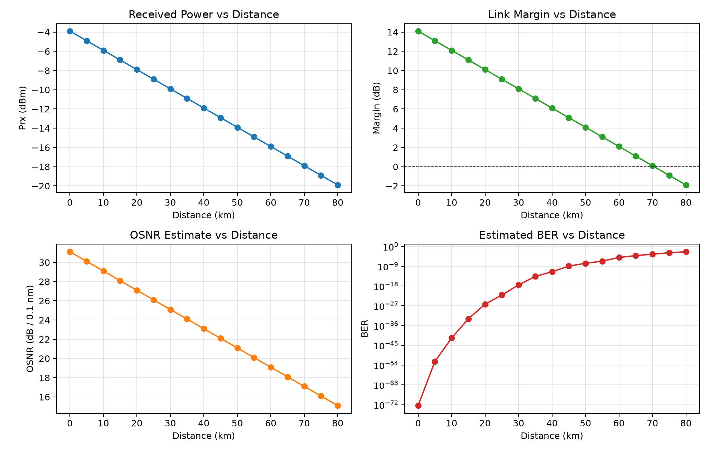
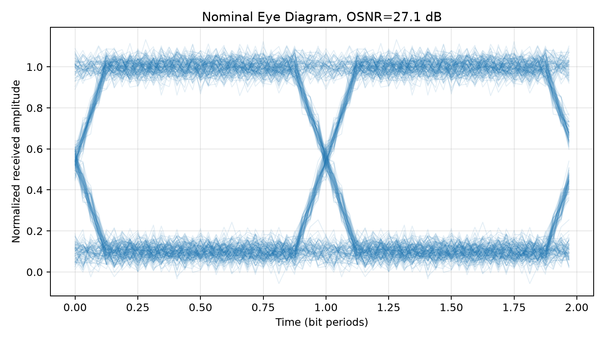
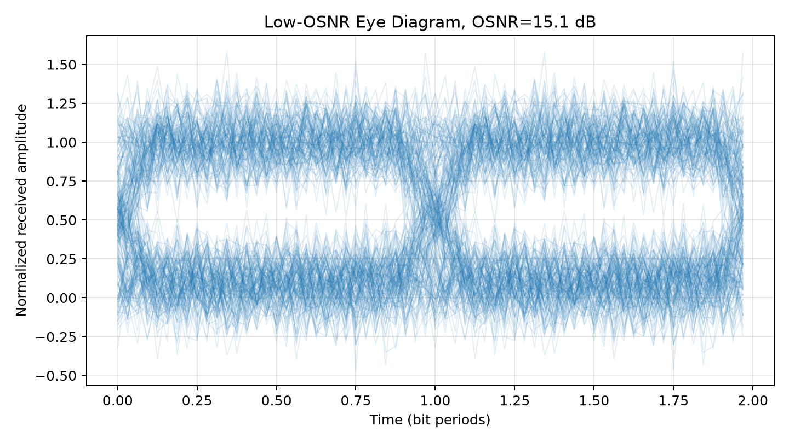
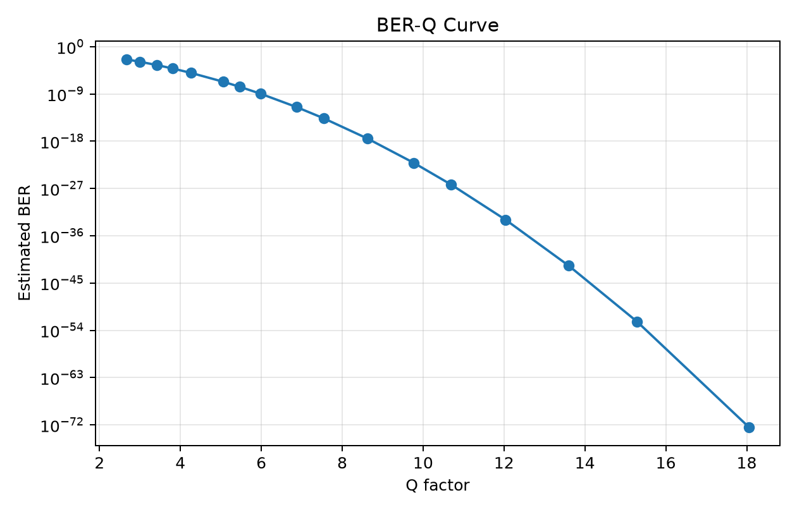

# Optical Link Budget and BER/Q-Factor Simulation

一个轻量级的光通信链路仿真项目，用 Python 完成链路预算、OSNR 估算、NRZ-OOK 信号生成、眼图绘制以及 Q 因子 / BER 计算。

项目尽量保持模型清晰、代码结构简单，适合用来理解光通信链路中功率、损耗、噪声和误码性能之间的关系。

[GitHub 上传与 IDE 运行指南](GITHUB_UPLOAD_GUIDE.md)

## 功能

- 计算光纤、连接器、熔接点、Mux/Demux 等损耗。
- 输出接收功率、链路余量和 OSNR 估算值。
- 生成 NRZ-OOK 波形，并加入高斯噪声。
- 绘制默认链路眼图和低 OSNR 对比眼图。
- 根据采样电平计算 Q 因子和 BER。
- 扫描不同传输距离，生成功率、余量、OSNR 和 BER 曲线。

## 结果示例

### 距离扫描



### 默认链路眼图



### 低 OSNR 眼图



### BER-Q 曲线



## 项目结构

```text
optical_link_budget_sim/
├─ README.md
├─ GITHUB_UPLOAD_GUIDE.md
├─ requirements.txt
├─ .gitignore
├─ run_demo.py
├─ configs/
│  └─ default.json
├─ src/
│  ├─ __init__.py
│  ├─ units.py
│  ├─ link_budget.py
│  ├─ osnr.py
│  ├─ ook_sim.py
│  ├─ metrics.py
│  └─ plots.py
└─ results/
   ├─ eye_diagram_nominal.png
   ├─ eye_diagram_low_osnr.png
   ├─ distance_sweep.png
   └─ ber_q_curve.png
```

## 环境要求

- Python 3.10 或更高版本
- numpy
- pandas
- matplotlib

安装依赖：

```powershell
pip install -r requirements.txt
```

## 快速开始

进入项目目录：

```powershell
Set-Location 'D:\工作\optical_link_budget_sim'
```

创建虚拟环境：

```powershell
python -m venv .venv
```

激活虚拟环境：

```powershell
.\.venv\Scripts\Activate.ps1
```

如果 PowerShell 提示脚本执行策略限制，可以只在当前终端会话中放开限制：

```powershell
Set-ExecutionPolicy -Scope Process -ExecutionPolicy Bypass
.\.venv\Scripts\Activate.ps1
```

安装依赖：

```powershell
python -m pip install --upgrade pip
pip install -r requirements.txt
```

运行示例：

```powershell
python run_demo.py
```

运行后会在 `results/` 目录生成结果文件。

如果希望运行后直接显示四张结果图：

```powershell
python run_demo.py --show
```

该命令会在生成结果后弹出一个 2x2 图像窗口，依次显示距离扫描图、默认链路眼图、低 OSNR 眼图和 BER-Q 曲线。

示例输出：

```text
Single-case result
  Rx power: -7.90 dBm
  Link margin: 10.10 dB
  OSNR: 27.10 dB / 0.1 nm (configured optical noise floor)
  Q factor: 11.39
  BER estimate: 2.412e-30

Generated 17 sweep points in D:\工作\optical_link_budget_sim\results
```

## 配置

默认参数位于 `configs/default.json`：

```json
{
  "tx_power_dBm": 0.0,
  "fiber_length_km": 20.0,
  "fiber_loss_dB_per_km": 0.2,
  "num_connectors": 2,
  "connector_loss_dB": 0.5,
  "num_splices": 4,
  "splice_loss_dB": 0.1,
  "mux_demux_loss_dB": 1.5,
  "other_loss_dB": 1.0,
  "amplifier_gain_dB": 0.0,
  "noise_figure_dB": 5.0,
  "receiver_sensitivity_dBm": -18.0,
  "noise_floor_dBm_per_0_1nm": -35.0,
  "wavelength_nm": 1550.0,
  "reference_bandwidth_nm": 0.1,
  "bit_rate_Gbps": 10.0,
  "samples_per_bit": 32,
  "num_bits": 4096,
  "extinction_ratio_dB": 10.0
}
```

可以通过修改这些参数观察链路性能变化。例如，增加 `fiber_length_km` 会提高光纤损耗，降低接收功率和 OSNR；降低 `extinction_ratio_dB` 会让 OOK 的 0/1 电平更难区分，眼图开口也会变小。

## 模型说明

### 链路预算

链路预算在 dB 域中完成。光纤损耗、连接器损耗、熔接损耗和器件损耗相加，放大器增益作为补偿项加入。

```text
fiber_loss_dB = fiber_length_km * fiber_loss_dB_per_km
```

```text
passive_loss_dB =
    fiber_loss_dB
  + connector_loss_total_dB
  + splice_loss_total_dB
  + mux_demux_loss_dB
  + other_loss_dB
```

```text
Prx_dBm = Ptx_dBm - passive_loss_dB + amplifier_gain_dB
```

```text
margin_dB = Prx_dBm - receiver_sensitivity_dBm
```

### OSNR 估算

无光放大器时，项目使用配置中的光噪声底估算 OSNR：

```text
OSNR = P_signal / P_noise_floor
```

配置了放大器增益时，项目使用简化的 EDFA ASE 噪声模型：

```text
P_ASE ≈ NF * h * nu * (G - 1) * B_ref
OSNR = P_signal / P_ASE
```

其中：

- `NF` 为线性噪声系数。
- `G` 为线性放大器增益。
- `h` 为普朗克常数。
- `nu` 为光频率。
- `B_ref` 为参考光带宽，默认取 0.1 nm。

### NRZ-OOK 波形

项目使用 NRZ-OOK 强度调制：

```text
bit 1 -> high optical intensity
bit 0 -> low optical intensity
```

生成过程：

1. 生成随机 bit 序列。
2. 将 bit 映射为高、低两个强度电平。
3. 对波形做轻微平滑，模拟有限带宽带来的边沿变缓。
4. 加入高斯噪声。
5. 在每个 bit 中心采样并判决。

### Q 因子与 BER

采样点按原始 bit 分成 1 电平和 0 电平两组：

```text
Q = (mu1 - mu0) / (sigma1 + sigma0)
```

在高斯噪声近似下：

```text
BER ≈ 0.5 * erfc(Q / sqrt(2))
```

Q 因子越大，两个电平分布分离得越明显，误码率越低。

## 代码模块

| 文件 | 作用 |
|---|---|
| `run_demo.py` | 项目入口，负责读取配置、运行单点仿真和距离扫描 |
| `src/units.py` | dB、dBm、线性功率单位转换 |
| `src/link_budget.py` | 链路预算计算 |
| `src/osnr.py` | OSNR 估算 |
| `src/ook_sim.py` | NRZ-OOK 波形生成和噪声注入 |
| `src/metrics.py` | Q 因子和 BER 计算 |
| `src/plots.py` | 眼图、距离扫描图和 BER-Q 曲线绘制 |

## 输出文件

运行 `python run_demo.py` 后，`results/` 中会生成：

| 文件 | 内容 |
|---|---|
| `single_case_summary.json` | 单点链路结果 |
| `distance_sweep.csv` | 不同传输距离下的扫描结果 |
| `eye_diagram_nominal.png` | 默认链路眼图 |
| `eye_diagram_low_osnr.png` | 低 OSNR 对比眼图 |
| `distance_sweep.png` | 接收功率、余量、OSNR 和 BER 随距离变化 |
| `ber_q_curve.png` | Q 因子与 BER 的关系曲线 |

## 可扩展方向

- 加入更真实的接收机带宽限制。
- 加入色散导致的脉冲展宽。
- 区分 PIN 和 APD 接收机噪声模型。
- 加入 EDFA 多跨链路的 OSNR 累积。
- 加入 PAM4 或相干调制格式。
- 加入 FEC 门限，用于判断不同距离下的链路可用性。

## 局限性

当前版本是一个简化模型，主要限制包括：

- 只实现 NRZ-OOK，没有实现 PAM4、QPSK 或 16QAM。
- 噪声使用高斯近似，没有完整区分热噪声、散粒噪声、RIN 和 TIA 噪声。
- 默认未加入色散、非线性和偏振效应。
- EDFA 噪声为单级近似模型，不覆盖完整多跨链路。
- 眼图基于简化电域波形，不是完整光电器件联合仿真。

## 参考资料

- OptiCommPy 文档  
  https://opticommpy.readthedocs.io/en/latest/getting_started.html
- MathWorks BER 分析文档  
  https://www.mathworks.com/help/comm/ug/bit-error-rate-analysis-techniques.html
- MathWorks 眼图文档  
  https://www.mathworks.com/help/comm/ref/eyediagram.html
- FOA 光纤链路损耗预算教程  
  https://www.thefoa.org/tech/lossbudg.htm
- IEEE 802.3cn OSNR Link Budget Methodology  
  https://www.ieee802.org/3/cn/public/18_11/lyubomirsky_3cn_01a_1118.pdf
